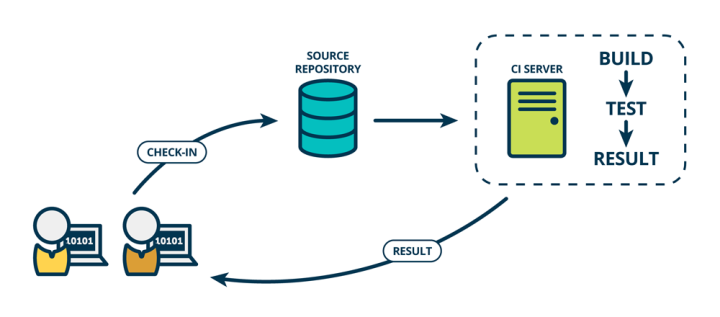

# 持续集成

### 什么是持续集成

持续集成（Continuous Integration），也就是我们经常说的 CI，是现代软件开发技术的基础。

[Martin Fowler](https://martinfowler.com/) 是这样形容和解释持续集成的：

> 持续集成正是针对上述一系列问题的一种软件开发实践，它倡导团队开发成员必须经常集成他们的工作，甚至每天都可能发生多次集成。而每次的集成都是通过自动化的构建来验证，包括自动编译、发布和测试，从而尽快地发现集成错误，让团队能够更快的开发内聚的软件。

### 为什么我们需要持续集成

持续集成的核心价值在于：

1. 降低风险，每天都可能发生多次集成，有利于及早发现软件质量问题。
2. 自动完成，通过自动化工具可以避免开发人员投入过多精力
3. 软件运行状态随时可看，可以增加领导和团队成员对项目的信心。
4. 利于对未来进行把控，持续集成的信息有利于我们对未来进行更好地规划和把控。

### 如何进行持续测试

如果选择了需要进行持续测试，就可以有两种选择：

1. 使用第三方提供的 CI 服务，如 Travis-CI。Travis-CI 可以为 Github 上的开源项目提供免费 CI 服务。在后面的章节中，也会提到在各个语言中如何配置 Travis-CI，从而达到自动化持续集成。在下面这个教程中，将会简单介绍 Travis-CI 的使用：

    [如何简单入门使用Travis-CI持续集成](https://github.com/nukc/how-to-use-travis-ci)

    > **Tips:** 对于 Github 上私有仓库，Travis-CI 不提供免费服务。对于教育账号，则依然免费。

2. 自己搭建 CI 服务器。如果 Travis-CI 不能满足你的项目需求，这时候可以自己搭建 CI 服务器来为项目提供持续集成服务。主流的选择是 [Jenkins](https://jenkins.io/)。如有需求，请移步[官网文档](https://jenkins.io/doc/)处学习。

### 推荐材料

[如何简单入门使用Travis-CI持续集成](https://github.com/nukc/how-to-use-travis-ci)

[Jenkins 文档](https://jenkins.io/doc/)