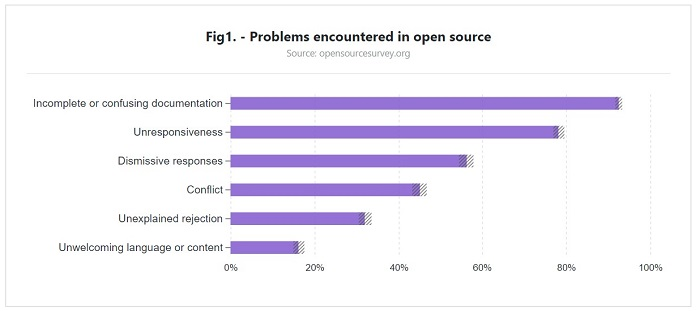

# 文档管理

### 文档的重要

很遗憾，很多人都忽视了文档对一个项目取得成功的重要性。

科技作者 Mike Pope 曾经如此总结文档的需求：

> 我们需要告诉开发者，缺了文档，就等于废了项目。你不仅必须写文档，还得在其中好好解释、教导和示范。这样的话，大家都会很高兴的。这不仅关乎你的文档，也关乎你的产品！

GitHub《2017 开源调查》中排名靠前的几个问题，在“文档不完整或困惑”之后，分别是“不回应”、“不屑”、“冲突”、“不明原因的拒绝”、以及“不欢迎的语言或内容”。

GitHub 在调查中强调：文档有助于营造一个包容性的社区，清楚地解释了一个项目的过程，比如贡献指南和行为准则，大家会很珍视这样的开源工作、但它往往被低估。

调查还指出，高达 60% 的贡献者很少或从未对文档提供过帮助。

### 如何编写文档

1. README文档。可参考 Udacity 免费课程： [编写 README 文档](https://cn.udacity.com/course/writing-readmes--ud777)
2. API文档。主流的文档工具一般有，[Sphinx](http://www.sphinx-doc.org/en/stable/), [doxygen](http://www.stack.nl/~dimitri/doxygen/) 等等。我们将会在后面的章节详细介绍这些工具的使用。
3. 托管网站。[Read the Docs](https://readthedocs.org/) 可以为开源项目托管文档。

### 推荐阅读

Udacity Free Course (en/zh) : [编写 README 文档](https://cn.udacity.com/course/writing-readmes--ud777)