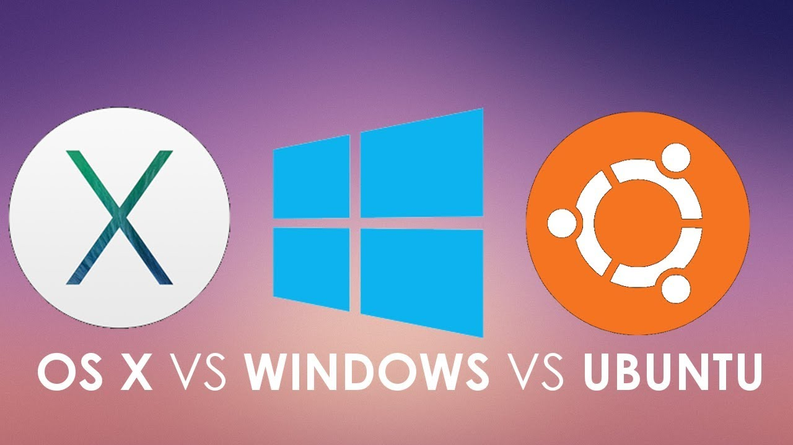

# 开发环境

### Linux

Linux是一个自由的，免费的，源码开放的操作系统。也是开源软件中最著名的例子。其最主要的目的就是为了建立不受任何商品化软件版权制约的，全世界都能使用的类Unix兼容产品。而我们将服务器部署在Linux将会更加的稳定、安全、高效以及出色的性能这是windows无法比的。

关于如何选择 Linux 发行版 ： 我的建议是选用 [Ubuntu 16.04](http://www.ubuntu.org.cn/download/desktop)

入门资料 ： [鸟哥的Linux私房菜](http://linux.vbird.org/)

Shell 入门课程： [Linux 命令行基础](https://cn.udacity.com/course/linux-command-line-basics--ud595)

接下来的所有具体内容，如没有特别说明，都是将基于 Ubuntu 的。当然并不影响 Mac OS 和 Windows 下的开发者阅读这份指南。

### Editor or IDE

市面上Editor和IDE种类之多，让一些朋友无法选择。而对这些Editor和IDE的选择本身是一个很主观的事情，每个人都有自己的喜好和见解。最好的方法当然是自己去试，直到找到自己喜欢的那个，但是我这里还是相对公正的给出我心中最理想的选择。

#### Vim

Vim 是一个历史悠久的文本编辑器，采用模式编辑的理念，即它提供了多种模式，按键在不同的模式下作用不同。你可以在 *普通模式* 下浏览文件，在 *插入模式* 下插入文本，在 *可视模式* 下选择行，在 *命令模式* 下执行命令等等。起初这听起来可能很复杂，但是这有一个很大的优点：不需要通过同时按住多个键来完成操作，大多数时候你只需要依次按下这些按键即可。越常用的操作，所需要的按键数量越少。

因为 Vim 是直接在 Shell 中进行操作，所以我们可以将 Vim 用作远程服务器端临时调整代码所用的编辑器。鉴于 Vim 的强大扩展性，可定制性和性能，Vim当然也可以作为主力环境的一种选择。

推荐两个入门的资料:

[vim-galore](https://github.com/wsdjeg/vim-galore-zh_cn)

[简明 VIM 练级攻略](https://coolshell.cn/articles/5426.html)

#### [VS Code](https://code.visualstudio.com/) / [Atom](https://atom.io/) / [Sublime Text](http://www.sublimetext.com/)

以上三者为现在比较主流的代码编辑器了，三者也常常被拿在一起作比较。其实如果允许的话，三者都可以试一试，最终找到自己最喜欢的就好。三者都非常适合当做主力的开发环境，通过各种插件的自由配置，你可以搭建一个个性化的开发环境。当然如果你就得有必要，也可以开发自己的插件。

*本系列指南就是在 VS Code 下编写完成。*

三者性能分析的文章 ： [Sublime Text vs Visual Studio Code vs Atom Performance Test (Dec 2016)](https://blog.xinhong.me/post/sublime-text-vs-vscode-vs-atom-performance-dec-2016/)

> **Tips:** 三者都是全平台支持。Sublime Text 目前是收费的（提供无限时长的试用），另外两个均为 Github 上开源项目。

### 推荐材料

Udacity Free Course : [Linux 命令行基础](https://cn.udacity.com/course/linux-command-line-basics--ud595)

鸟哥的Linux私房菜 : [http://linux.vbird.org/](http://linux.vbird.org/)

Vim Galore : [https://github.com/wsdjeg/vim-galore-zh_cn](https://github.com/wsdjeg/vim-galore-zh_cn)

简明 VIM 练级攻略 ： [https://coolshell.cn/articles/5426.html](https://coolshell.cn/articles/5426.html)