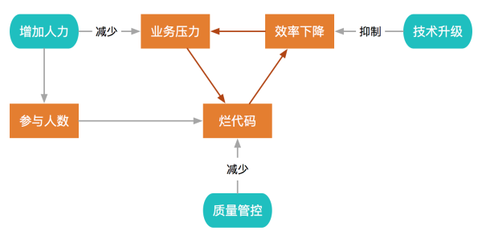

# 代码质量

### 为什么我们关心代码质量

我们讨论的代码质量指的是代码本身的质量，包括复杂度、重复率、代码风格等要素。

代码质量下降通常会自成因果，导致恶性循环：

* 破窗效应：在烂代码上继续生产烂代码的心理负担小很多
* 传染性：烂代码传递着一种不在意质量，只看业务成果的负面信息，会伤害团队的技术热情和工作氛围，导致更多烂代码出现

详细的代码质量的管理和分析可以参见美团的两篇文章。以一篇从团队开发的角度，分析控制代码质量的重要性，并给出了一些理论上的指导。第二篇详细的讲述了美团在自己的代码质量检测平台中使用的衡量标准，以量化的角度讲述什么样的代码是所谓的高质量的代码。

[代码质量管控的四个阶段](https://zhuanlan.zhihu.com/p/29231125)

[代码质量管控 -- 复杂度检测](https://zhuanlan.zhihu.com/p/29438120)

### 流行工具

1. 代码静态分析工具：

    各个语言都有很多静态分析工具，比如 Clang，pylint 等等。基本上主流的分析工具都可以作为插件安装到你的编辑器中，在开发的过程中就会给出建议和提示。这些工具是代码质量的基本保证。

2. 在线检测平台：

    许多在现的代码检测平台，大多数都对开源项目免费。在 Github 的 [Marketplace](https://github.com/marketplace/category/code-quality) 中，列举了一个关于代码质量检测平台的清单。

### 推荐阅读

[代码质量管控的四个阶段](https://zhuanlan.zhihu.com/p/29231125)

[代码质量管控 -- 复杂度检测](https://zhuanlan.zhihu.com/p/29438120)